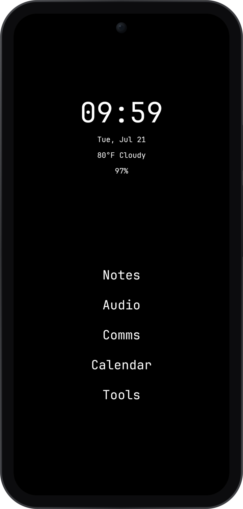
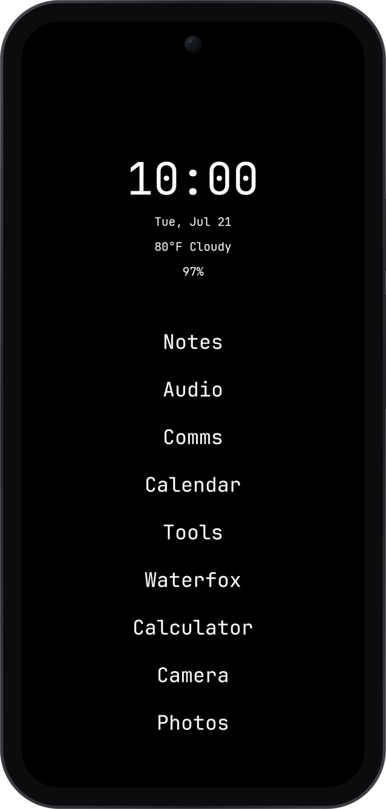
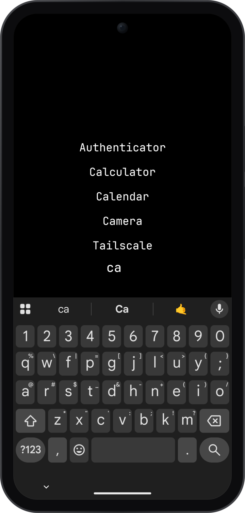
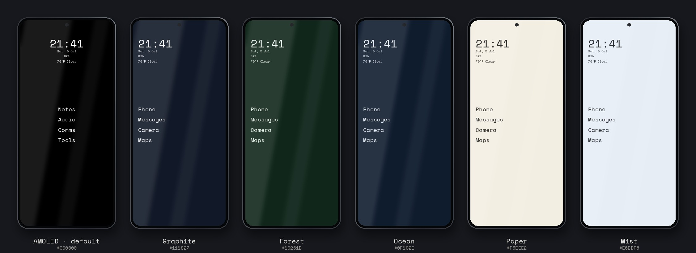

# PiercingXX Launcher

A minimal, text-only Android launcher built for focus. No icons, no
wallpaper clutter — just the apps you actually use, a fast search
drawer, and a clean AMOLED-black home screen.

| Home | Folders | Drawer Search |
|------|---------|---------------|
|  |  |  |

### Theme presets



## Features

- **Text-based home screen** — up to 8 app slots plus inline folders
  that expand in place, centered layout, no icons
- **Widgets** — clock (12/24h follows system), date, weather
  (Open-Meteo, no API key), and battery, reorderable with per-widget
  tap actions
- **Fast app drawer** — bottom-anchored search, swipe up to open,
  `!query` jumps straight to DuckDuckGo, Enter launches the top hit
- **Folders** — group apps into named folders that live in home slots
  and drop open inline
- **Gestures** — swipe left/right to launch apps, swipe down for
  notifications or web search, double-tap to lock
- **Theming** — six built-in presets plus custom background color,
  light/dark/system appearance, adjustable text size
- **Fonts** — bundled monospace fonts (JetBrains Mono, JetBrains Mono
  Nerd, Space Mono) or import your own TTF/OTF
- **Privacy-minded** — hide apps from the drawer, per-app notification
  muting, work-profile support
- **Backup/restore** — full JSON export and import of every setting
- **Pinned shortcuts** — Android pinned-shortcut support in the drawer
  and home slots

## Building

Requires JDK 17 and the Android SDK (API 34).

```sh
./gradlew assembleDebug
```

The APK lands in `app/build/outputs/apk/debug/`.

## Installing

```sh
./gradlew installDebug
```

Then set PiercingXX as your default launcher when prompted (or via
Settings → Default Launcher).

## Version

0.61

## License

Proprietary — see [LICENSE](LICENSE).
